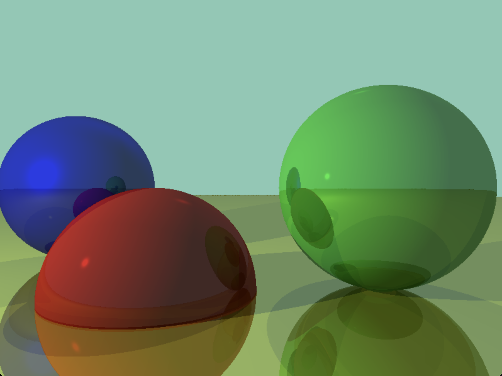

# 3D Rendering Engine (C)

A minimalistic 3D rendering engine implemented in C, built from scratch to explore the fundamentals of computer graphics. This project provides a foundational understanding of how 3D scenes are rendered, incorporating basic camera controls, lighting, and object interactions.

**Inspired by:**
This project was completed heavily utilizing the concepts and principles laid out in:

```
@book{gambetta2021computer,
  title={Computer Graphics from Scratch: A Programmer's Introduction to 3D Rendering},
  author={Gambetta, Gabriel},
  year={2021},
  publisher={No Starch Press}
}

```

The book served as an invaluable guide for understanding the core algorithms and mathematical concepts behind ray tracing.

## Table of Contents

  * [Features](https://www.google.com/search?q=%23features)
  * [Preview](https://www.google.com/search?q=%23preview)
  * [How to Build and Run](https://www.google.com/search?q=%23how-to-build-and-run)
  * [Usage](https://www.google.com/search?q=%23usage)
  * [License](https://www.google.com/search?q=%23license)

## Features

  * **Ray Tracing Core:** Implements the fundamental ray tracing algorithm to determine pixel colors based on ray-object intersections.
  * **Sphere Primitives:** Renders spherical objects within the scene.
  * **Basic Lighting:** Supports ambient, point, and directional lights.
  * **Diffuse and Specular Reflection:** Calculates how light reflects off surfaces, including Lambertian diffuse and Phong specular components.
  * **Reflection:** Handles recursive ray tracing for reflective surfaces.
  * **Basic Camera Controls:**
      * **WASD:** Move the camera forward, backward, left, and right relative to its orientation.
      * **Space / C:** Move the camera up (Space) and down (C) in world space.
      * **Arrow Keys:** Rotate the camera's view (yaw for left/right, pitch for up/down).

## Preview



## How to Build and Run

This project requires `SDL2`. Ensure you have it installed on your system.

1.  **Clone the repository:**

    ```bash
    git clone https://github.com/adamerikoff/rendering_engine.git
    cd rendering_engine
    ```

2.  **Compile:**
    This project uses a `Makefile` for compilation. Ensure `pkg-config` is installed and configured correctly for SDL2.
    To build the Ray Casting Engine (as described in the Features section):

    ```bash
    make build_ray
    ```

    If you intend to build the Rasterizing Engine:

    ```bash
    make build_raster
    ```

3.  **Run:**
    To run the Ray Casting Engine:

    ```bash
    ./bin/ray_casting_engine
    ```

    Or, using the `Makefile` target:

    ```bash
    make run_ray
    ```

    To run the Rasterizing Engine (if you built it):

    ```bash
    ./bin/rasterizing_engine
    ```

    Or, using the `Makefile` target:

    ```bash
    make run_raster
    ```

## Usage

Once the application is running, you can interact with the camera:

  * **Movement:**
      * `W`: Move Forward
      * `S`: Move Backward
      * `A`: Move Left
      * `D`: Move Right
      * `Space`: Move Up (world Y-axis)
      * `C`: Move Down (world Y-axis)
  * **Rotation (Look Around):**
      * `Left Arrow`: Rotate Camera Left (Yaw)
      * `Right Arrow`: Rotate Camera Right (Yaw)
      * `Up Arrow`: Look Up (Pitch)
      * `Down Arrow`: Look Down (Pitch)
  * **Exit:**
      * `ESC`: Exit the application.
      * Close the window.

## License

This project is open-source and available under the [MIT License](LICENSE.md).